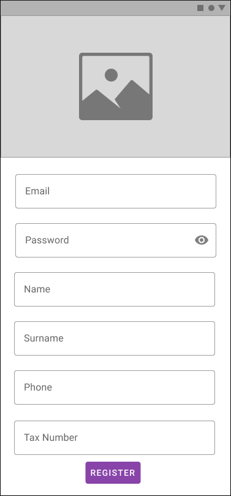
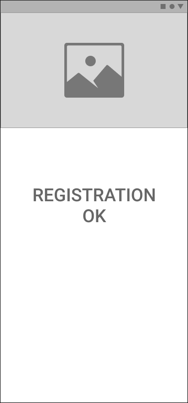

# Overview
We would like you to write a simple App, mocking the backend. Below is the user story, followed by the design.
The App should be written in a language which support both Android and ios (i.e. React Native or Flutter)

# Acceptance Criteria

## Splash screen:
- When the app opens, the splash should be displayed.
- When the user taps, the splash should open the Registration screen.
- After 2 seconds, the splash is automatically redirecting to the Registration screen.

## Registration screen:
- When the user taps on the bottom button, the form is validated and shows any error.
- If the form is correct, the app makes a call to the backend (mocked) and redirect to the Confirmation screen.

## Confirmation screen:
- Only shows a confirmation message.

## Others:
- The logo is the same in each page.
- The code is delivered in a new Github repo.

# Design

## Splash screen

<kbd>

</kbd>

## Registration screen

<kbd>

</kbd>

## Confirmation screen

<kbd>

</kbd>

